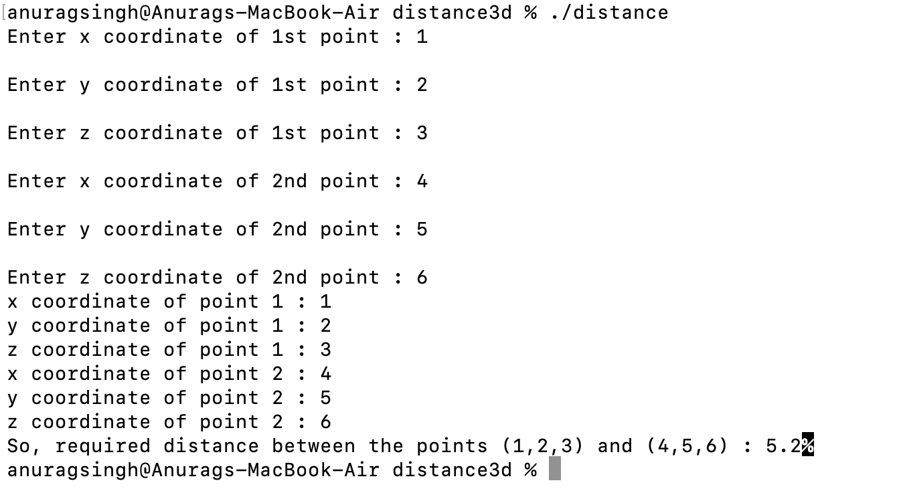

# 3D Distance Calculator in C++

This program calculates the distance between two points in 3D space using the Euclidean Distance Formula.

## Equation 
\[
\text{Distance} = \sqrt{(x_2 - x_1)^2 + (y_2 - y_1)^2 + (z_2 - z_1)^2}
\]

## How to Run 

### Prerequisites

- **macOS**: Uses Terminal (zsh) – no extra installations needed.
- **Windows**:  
  - Install a C++ compiler such as [MinGW](http://www.mingw.org/) and use Command Prompt or PowerShell.  
  - OR install [WSL](https://learn.microsoft.com/en-us/windows/wsl/) and use a Linux shell.  
  - OR use an IDE like Code::Blocks, Visual Studio, or VS Code with a C++ extension.  

### Steps

1. Clone the repo:

   ```sh
   git clone <your-repo-url>
   cd Compiler-Design-Assignment
   ```

2. Compile the program:

   - On **macOS**:

     ```sh
     clang++ distance.cpp -o distance
     ```

   - On **Windows with MinGW**:

     ```sh
     g++ distance.cpp -o distance.exe
     ```

3. Run the program:

   - On **macOS/Linux**:

     ```sh
     ./distance
     ```

   - On **Windows**:

     ```sh
     distance.exe
     ```

4. Enter the coordinates when prompted.

## Sample Output


